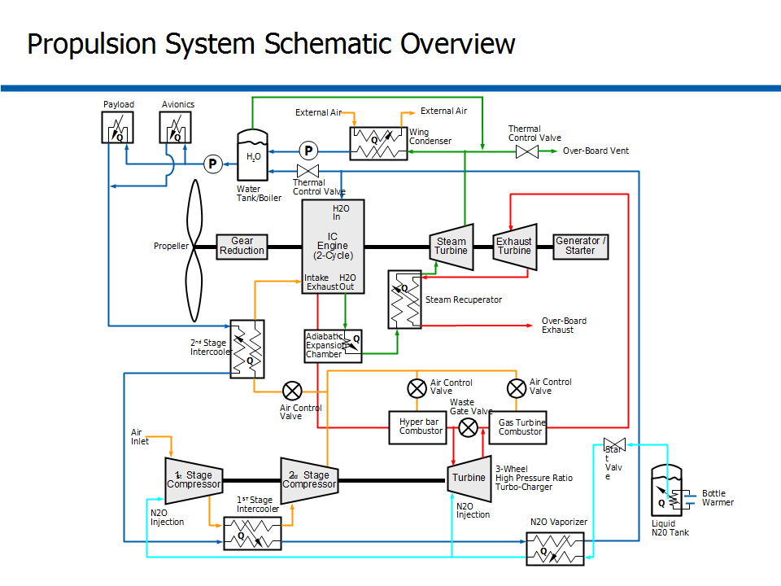
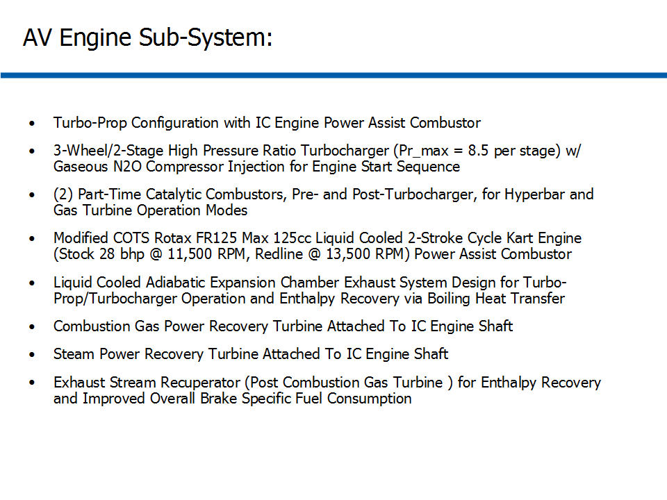
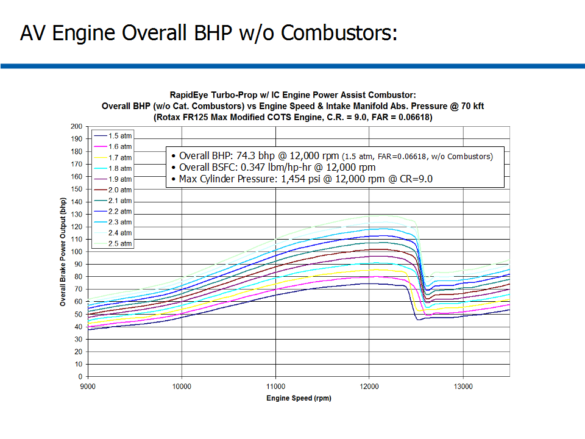
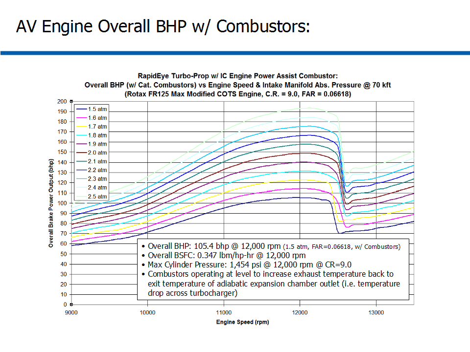
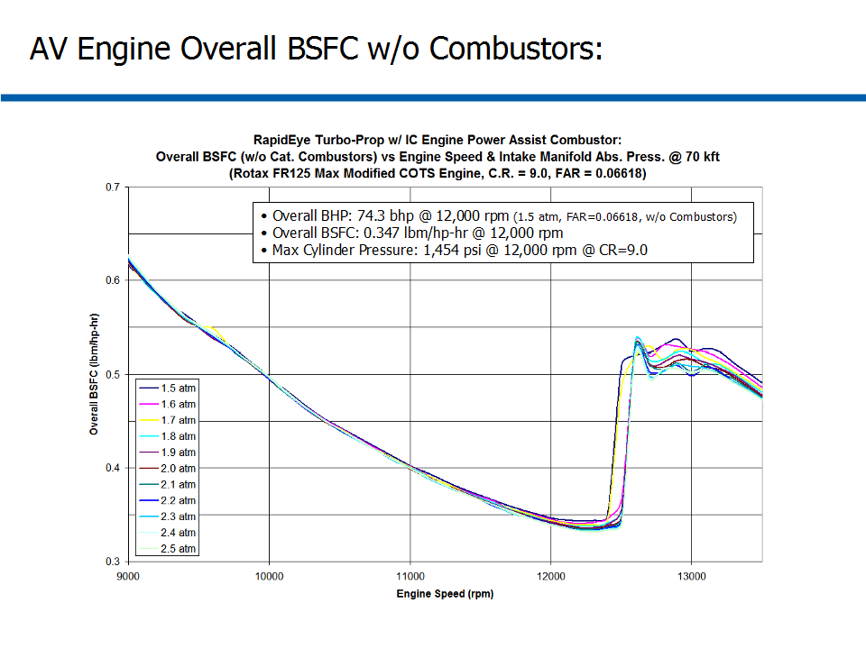
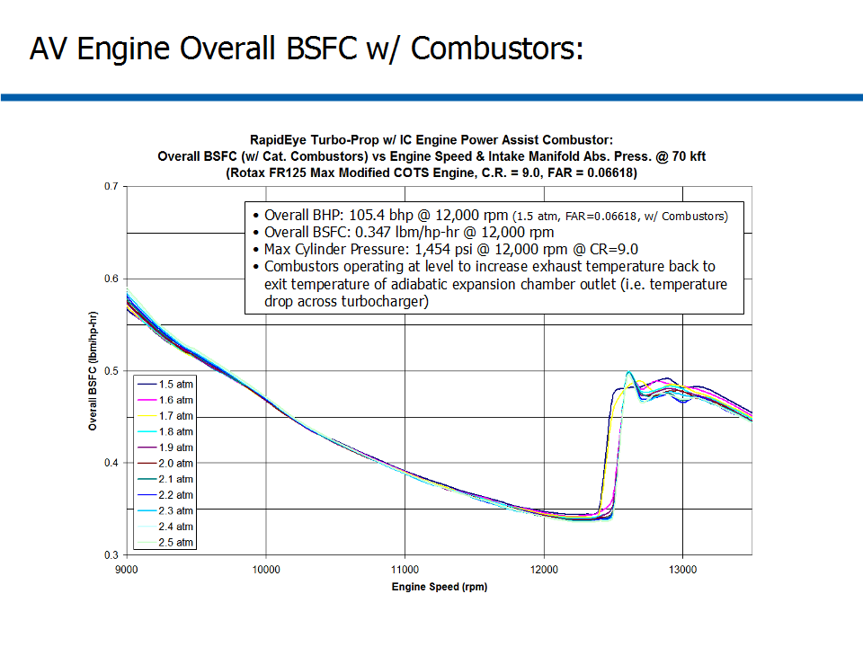

# ========================================
# HyperBar Combustor Assisted Turbocharged 2-Stroke Internal Combustion Engine Performance Analysis:
# ========================================

## I. Example Application Schematic of HyperBar Combustor Assisted Turbocharged 2-Stroke ICE:

## 
## 
## II. Overview of HyperBar Combustor Assisted Turbocharged 2-Stroke IC Engine Sub-System:

## 
## 
## III. Comparison of BHP vs. RPM w/o Combustors for Different Intake Boost Levels:

## 
## 
## IV. Comparison of BHP vs. RPM w/ Combustors for Different Intake Boost Levels:

## 
## 
## V. Comparison of BSFC vs. RPM w/o Combustors for Different Intake Boost Levels:

## 
## 
## VI. Comparison of BSFC vs. RPM w/ Combustors for Different Intake Boost Levels:

## 
## *Notes: 
## 1. Turbomachinery Performance Data and Analysis performed using AxStream, SoftInWay Inc.
## 2. ICE Performance Data and Analysis performed using "GT-Suite", Gamma Technologies Inc.
